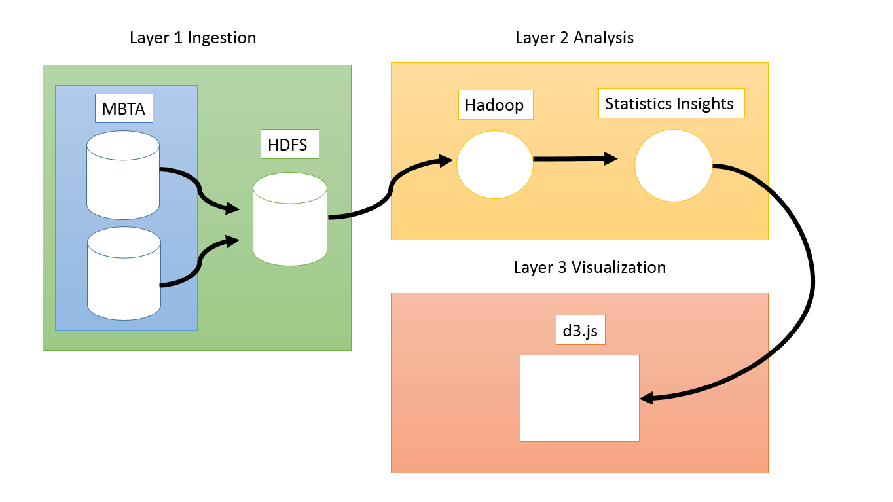

## MBTA Bus Performance: Data Capture and Analysis Outline

https://docs.google.com/a/bu.edu/document/d/1Yow5tvJqMRiCaCxUQpYQptxXOEuehuKt91Y38R4DMbs/edit
 
### Vision and Goals of the Project:
MBTA Bus Performance is a project in collaboration with the MBTA staff to identify patterns, insights, and new uses for data that can provide analysis to support MBTA service-delivery. Goals of the project include:
- A scalable, incremental system that ingests and analyzes transit data, which updates at least once a day
- Visualization of MBTA data in the form of static map representations and bar graphs.
- Use the data from GTFS and Transit Master to compare key bus route travel time pre- and post-Key Bus Route Program (KBRP) project
- Observe trends in the data and try to understand the problems the MBTA key bus routes continue to experience
- Recommend solutions to the problems detected to make the buses run more efficiently
 
### Users/Personas of the Project
At first, the users will be MBTA personnel, but hopefully, the project will later be available to application developers, MBTA customers and MGHPCC contributing companies.

### User Story
As an employee of the MBTA, I want to better understand how the Key Bus Route Program improved the travel times of bus users, so that I can continue to improve the experience of our passengers.
 
### Scope and Features of the Project:
- Compare pertinent data pre- and post-KBRP to see how the changes impacted bus service. Specifically, we will be looking at these key areas:
  - Overall travel time for each trip for key routes
  - Incremental travel time for each trip (per station or every few stations)
  - Variation between scheduled arrival times and actual arrival times
  - Headway between buses
  - Average speed of key bus routes
  - Rate of passenger entries
- Visualization of the data. Must be clear and concise. It may also be interactive (if time permits).
 
### Solution concept:

A final report that includes several bar graphs and charts highlighting the differences between the pre- and post-KBRP data. The report will state which issues have been rectified, which are ongoing, and which new problems have been introduced.
In the report, recommendations to improve bus efficiency will be made.

Global Architectural Structure Of the Project and a Walkthrough:
Below is a description of the system components that are building blocks of the architectural design:
- MBTA datasets: The sources of data are taken from GTFS, Transit Master, and Smart Bus Mart.
- GTFS: General Transit Feed Specification contains operation schedules and other associated geographic information.
- Transit Master: TM Main contains information similar to GTFS’ and keys that explain the identifiers used for different bus routes. TM Daily Log contains data of time point crossing, including latitude and longitude coordinates for every bus every 60 seconds.
- Smart Bus Mart: The set contains reporting data with aggregation based on the on time performance standard.
- HDFS: Hadoop Distributed File System is a distributed file system, fault-tolerant, designed to be deployed on low-cost hardware.
- GTFS: General Transit Feed Specification defines a common format for public transportation schedules and associated geographic information.
- Hadoop: Open-source software framework for storing and processing big data on distributed file systems on large clusters. Allows massive data storage and faster processing.
- d3.js: JavaScript library that uses digital data to drive the creation of dynamic and interactive graphical forms on the web browser.

 
### Acceptance criteria:

We should at a minimum complete the data analysis between the pre- and post-KBRP eras and present the differences in our final report. We should be able to identify which problems have been fixed and which ones persist.
 
### Release Planning: (We need to work on this)

Detailed notes and plans are on Trello board:
https://trello.com/b/iFDLD6Vq/mbta-bus-performance-data-capture-and-analysis

Meeting notes and documentation are on Github:
https://github.com/BU-EC500-SP15/mbta-busses/tree/master

Release #1 (due by Week 5):
User stories: Create visualizations with GTFS data.

Release #2 (due by Week 7): 
Scrub our personal information from Transit Master. Complete data ingestion from MBTA’s data. We do not need the Transit Master data until after Week 5.

Release #3 (due by Week 9):
Complete analytics with MapReduce and Hadoop.

Release #4 and #5 (due by Week 11 and 13):
Visualizations and extra features based on what the MBTA personnel determine is needed.

