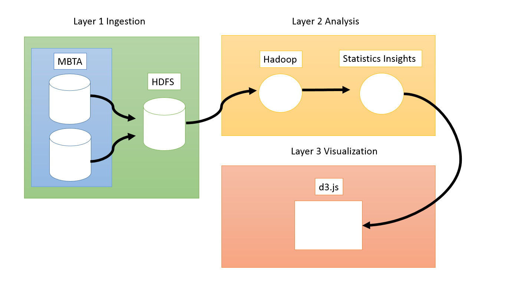
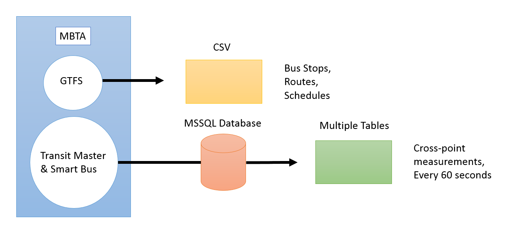

## MBTA Bus Performance: Data Capture and Analysis Proposal

https://docs.google.com/a/bu.edu/document/d/1Yow5tvJqMRiCaCxUQpYQptxXOEuehuKt91Y38R4DMbs/edit
 
### Vision and Goals of the Project:
[MBTA Bus Performance](https://okrieg.github.io/EC500/PROJECTS/MBTABusPerformance.html) is a project in collaboration with the MBTA staff to identify patterns, insights, and new uses for data that can provide analysis to support MBTA service-delivery. Goals of the project include:
- A scalable, incremental system that ingests and analyzes transit data, which updates at least once a day
- [Visualization of MBTA data](http://mbtaviz.github.io/) in the form of static map representations and bar graphs
- Using the data from GTFS and Transit Master to compare key bus route travel time pre- and post-Key Bus Route Program (KBRP) project
- Observing trends in the data and trying to understand the problems the MBTA key bus routes continue to experience
- Recommending solutions to the problems detected to make the buses run more efficiently
 
#### Users/Personas of the Project
At first, the users will be MBTA personnel, but hopefully, the project will later be available to application developers, MBTA customers and MGHPCC contributing companies.

#### User Story
As an employee of the MBTA, I want to better understand how the Key Bus Route Program improved the travel times of bus users, so that I can continue to improve the experience of our passengers.
 
### Scope and Features of the Project:
MBTA Bus Performance
- Compares pertinent data pre- and post-KBRP to see how the changes impacted bus service. Specifically, we will be looking at these key areas:
  - Overall travel time for each trip for key routes
  - Incremental travel time for each trip (per station or every few stations)
  - Variation between scheduled arrival times and actual arrival times
  - Headway between buses
  - Average speed of key bus routes
  - Rate of passenger entries
- Visualization of the data. Must be clear and concise so as to be accessible to MBTA employees. It may also be interactive (if time permits).
 
### Solution concept:

A final report that includes several bar graphs and charts highlighting the differences between the pre- and post-KBRP data. The report will state which issues have been rectified, which are ongoing, and which new problems have been introduced.
In the report, recommendations to improve bus efficiency will be made.

#### Global Architectural Structure Of the Project and a Walkthrough:

Below is a description of the system components that are building blocks of the architectural design:
- MBTA datasets: The sources of data are taken from GTFS, Transit Master, and Smart Bus Mart
- GTFS: General Transit Feed Specification defines a common format for public transportation schedules and associated geographic information
- Transit Master: TM Main contains information similar to GTFS’ and keys that explain the identifiers used for different bus routes. TM Daily Log contains data of time point crossing, including latitude and longitude coordinates for every bus every 60 seconds
- Smart Bus Mart: The set contains reporting data with aggregation based on the on time performance standard.
- HDFS: Hadoop Distributed File System is a distributed file system, fault-tolerant, designed to be deployed on low-cost hardware
- Hadoop: Open-source software framework for storing and processing big data on distributed file systems on large clusters. Allows massive data storage and faster processing
- d3.js: JavaScript library that uses digital data to drive the creation of dynamic and interactive graphical forms on the web browser

##### Figure 1: MBTA Project architecture. The entire model is within the responsibility of the project.
 
Figure 1 presents the architectural design for the MBTA Bus Performance project. Beginning at the Ingestion layer, MBTA data or publicly available data in the form of GTFS, Transit Master, and Smart Bus Mart is ingested into an HDFS.  From the HDFS, the contents move towards the Analysis layer where files are processed by Hadoop MapReduce functions to output Statistics and Insights. Lastly, those Statistics and Insights head into the Visualization layer where visualizations via d3.js are produced.

##### Figure 2: MBTA Bus Performance Data Model. The responsibility of the project includes analyzing GTFS, Transit Master, and Smart Bus data.

Figure 2 presents the structure of the MBTA Bus Performance data within the Ingestion layer. From the two sources of GTFS and a combination of Transit Master & Smart Bus, we will unload that data and perform analysis, insights, and visualization. GTFS provides publicly available transit data. Massachusetts Green High Performance Computing Center ([MGHPCC](http://www.mghpcc.org/)) contains a selection of Transit Master & Smart Bus, which provide MBTA exact measurements and information.

The Analysis layer will carefully look at data related to movement and on-time statuses of the MBTA buses. Hadoop MapReduce will process and sort the large collection of data into helpful analysis on but not limited to the [15 key bus routes](http://www.mbta.com/about_the_mbta/t_projects/?id=19047). The Visualization layer will use d3.js to produce a mapping of the MBTA key bus routes including visual performance and traffic inspection.

#### Design Implications and Discussion

Key design decisions and motivation behind them.
- Hadoop: To process big data-sets from GTFS and MBTA, an engine like Hadoop provides the power to analyze large amounts of semi-structured data. Hadoop shines when it comes to large, distributed data processing tasks. The main motivation for using Hadoop is that within the Analysis layer, we want to extract the data from the Ingestion layer, transform, and load it into a useful format for insight and visualization. Hadoop handles ETL (extract, transform, load) processes well by splitting integration tasks among servers in a cluster.
- d3.js: Within the visualization layer, d3.js provides a scalability and power to style and manipulate data into very useful graphics. The customizability of the JavaScript library provides the means to build any data visualization framework with the data processed and analyzed by Hadoop. The diversity of d3.js is accompanied by fast performance with little overhead while also supporting interaction and animation. An additional motivation is that d3.js also supports comma-separated values (CSV), the format of GTFS data.

### Acceptance criteria:

We should at a minimum complete the data analysis between the pre- and post-KBRP eras and present the differences in our final report. We should be able to identify which problems have been fixed and which ones persist.
 
### Release Planning:

Detailed notes and plans are on Trello board:
https://trello.com/b/iFDLD6Vq/mbta-bus-performance-data-capture-and-analysis

Meeting notes and documentation are on Github:
https://github.com/BU-EC500-SP15/mbta-busses/tree/master

Release #1 (due by Week 5):

User stories: Create visualizations with GTFS data. Parse the data using delimiters. Remove irrelevant data (i.e. subway, commuter rail, ferries, etc). [We do not need the Transit Master data until after Week 5.] The user can observe a mapping of the 15 key bus routes with visualizations of the bus on-time status or traffic.

Release #2 (due by Week 7): 

Scrub out personal information from Transit Master. After integrating data ingestion from MBTA’s data, the system has support for Transit Master and Smart Bus data. The user can see visualizations of this static data.

Release #3 (due by Week 9):

Complete analytics with MapReduce and Hadoop. Compare GTFS data against Transit Master data. Identify anomalies and/or trends. Compare pre- and post-KBRP data to identify if/where improvements were made. The user can view analysis and insight reports on the effects on bus performance for the 15 key bus routes.

Release #4 and #5 (due by Week 11 and 13):

Visualizations and extra features based on what the MBTA personnel determine is needed. Recommend changes to improve bus service. The user can visit an interactive web interface where he or she can view and select a complete analysis and visualization of MBTA bus performance.